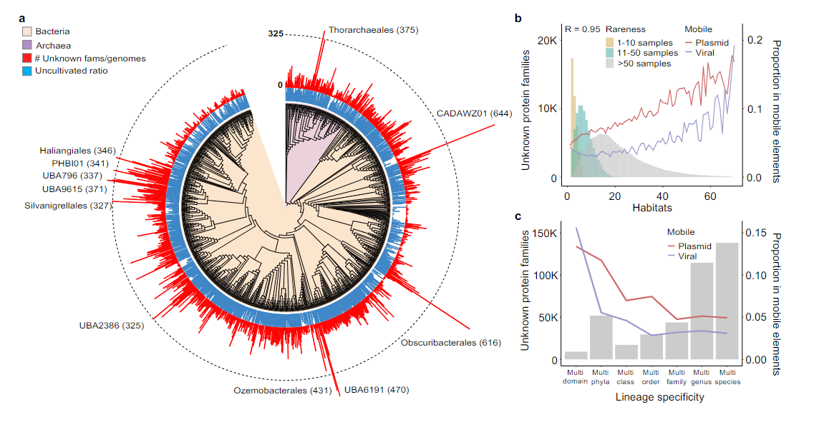

# NovFamilies
Scripts for generating the figures in `Functional and evolutionary significance of unknown genes from uncultivated taxa`.  A detailed pipeline for the steps followed for creating the FESNov gene family catalog are provided at https://github.com/AlvaroRodriguezDelRio/nov-fams-pipeline 

## Scripts

- ``generate_data_fig3A.py``: Script generating the proportion of uncultivated taxa and number of novel families per genome in each order of the GTDB tree. This data was later used to generate the figure in itol (https://itol.embl.de/) 
- ``figure2_A_matrix.py``: Script generating the KO presence / absence matrix in figure 2A.
- ``R_plots.r``: Script including the code for generating the remaining figures and some statistical tests. 

